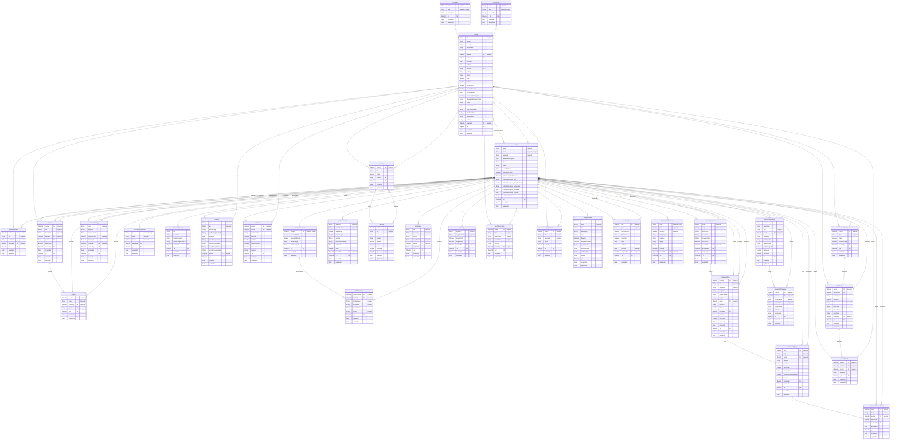

# Database diagram

> Generated from `backend/src/models/` by `npm run docs:generate`. Do not edit by hand.

```mermaid
erDiagram
  Course ||--o{ Announcement : "course"
  User ||--o{ Announcement : "postedBy"
  Question ||--o{ Answer : "question"
  User ||--o{ Answer : "postedBy"
  User }o--o{ Answer : "upvotes"
  User ||--o{ ChatConversation : "student"
  ChatConversation ||--o{ ChatMessage : "conversationId"
  User ||--o{ ChatMessage : "senderId"
  CommunityReply ||--o{ CommunityAnswerReply : "reply"
  User ||--o{ CommunityAnswerReply : "author"
  User ||--o{ CommunityAnswerReply : "archivedBy"
  User ||--o{ CommunityBadge : "createdBy"
  User ||--o{ CommunityBadge : "archivedBy"
  User ||--o{ CommunityChannel : "createdBy"
  User ||--o{ CommunityChannel : "archivedBy"
  User ||--o{ CommunityPointRule : "updatedBy"
  CommunityChannel ||--o{ CommunityPost : "channel"
  User ||--o{ CommunityPost : "author"
  User ||--o{ CommunityPost : "pinnedBy"
  User ||--o{ CommunityPost : "archivedBy"
  CommunityPost ||--o{ CommunityReply : "post"
  User ||--o{ CommunityReply : "author"
  User ||--o{ CommunityReply : "archivedBy"
  User ||--o{ CommunitySetting : "updatedBy"
  Category ||--o{ Course : "category"
  CourseType ||--o{ Course : "courseType"
  Teacher }o--o{ Course : "teachers"
  Section }o--o{ Course : "sections"
  User ||--o{ Course : "createdBy"
  User ||--o{ Enrollment : "student"
  Course ||--o{ Enrollment : "course"
  User ||--o{ GroupChatChannel : "creator"
  GroupChatChannel ||--o{ GroupChatMessage : "channel"
  User ||--o{ GroupChatMessage : "sender"
  User ||--o{ HomeHeroPost : "createdBy"
  Section ||--o{ Lecture : "section"
  User ||--o{ Notification : "sentBy"
  Course ||--o{ Question : "course"
  User ||--o{ Question : "postedBy"
  User }o--o{ Question : "upvotes"
  User ||--o{ Question : "resolvedBy"
  User ||--o{ QuizAttempt : "student"
  QuizBank ||--o{ QuizAttempt : "quizBank"
  Course ||--o{ QuizAttempt : "course"
  Course ||--o{ QuizBank : "course"
  QuizSection ||--o{ QuizBank : "quizSection"
  User ||--o{ QuizBank : "createdBy"
  Course ||--o{ QuizSection : "course"
  User ||--o{ QuizSection : "createdBy"
  Course ||--o{ Section : "course"
  Lecture }o--o{ Section : "lectures"
  User ||--o{ SiteLogo : "updatedBy"
  Course ||--o{ StudyCurriculum : "course"
  User ||--o{ StudyCurriculum : "postedBy"
  Course ||--o{ StudyMaterial : "course"
  User ||--o{ StudyMaterial : "postedBy"
  User ||--o{ StudySchedule : "user"
  User ||--o{ Subscription : "user"
  User ||--o{ Subscription : "assignedBy"
  User ||--o{ SubscriptionPlanConfig : "createdBy"
  User ||--o{ Teacher : "userId"
  Course }o--o{ User : "purchasedCourses"
  Announcement {
    ObjectId course FK "required"
    String title "required"
    String description "required"
    ObjectId postedBy FK "required"
    ObjectId _id PK
    Date createdAt
    Date updatedAt
  }
  Answer {
    ObjectId question FK "required"
    String body "required"
    ObjectId postedBy FK "required"
    Array upvotes FK
    ObjectId _id PK
    Date createdAt
    Date updatedAt
  }
  Category {
    String name "required"
    String slug "required, unique"
    String description
    ObjectId _id PK
    Date createdAt
    Date updatedAt
  }
  ChatConversation {
    ObjectId student FK "required, unique"
    Number unreadByStaff
    Number unreadByStudent
    String lastMessage
    Date lastMessageAt
    ObjectId _id PK
    Date createdAt
    Date updatedAt
  }
  ChatMessage {
    ObjectId conversationId FK "required"
    ObjectId senderId FK "required"
    String senderName "required"
    String senderRole "required"
    String senderAvatar
    String content "required"
    ObjectId _id PK
    Date createdAt
    Date updatedAt
  }
  CommunityAnswerReply {
    ObjectId reply FK "required"
    String body "required"
    ObjectId author FK "required"
    Boolean isArchived
    ObjectId archivedBy FK
    Date archivedAt
    ObjectId _id PK
    Date createdAt
    Date updatedAt
  }
  CommunityBadge {
    String name "required"
    String imageUrl
    String imagePublicId
    Number requiredPoints "required"
    Boolean isArchived
    ObjectId createdBy FK "required"
    ObjectId archivedBy FK
    Date archivedAt
    ObjectId _id PK
    Date createdAt
    Date updatedAt
  }
  CommunityChannel {
    String name "required"
    String slug "required, unique"
    String description
    String imageUrl
    String imagePublicId
    Boolean isArchived
    ObjectId createdBy FK "required"
    ObjectId archivedBy FK
    Date archivedAt
    ObjectId _id PK
    Date createdAt
    Date updatedAt
  }
  CommunityPointRule {
    String key "required, unique"
    String label "required"
    Number points "required"
    ObjectId updatedBy FK
    ObjectId _id PK
    Date createdAt
    Date updatedAt
  }
  CommunityPost {
    ObjectId channel FK "required"
    String title "required"
    String description "required"
    String imageUrl
    String imagePublicId
    Array images
    ObjectId author FK "required"
    Array reactions
    Boolean isPinned
    ObjectId pinnedBy FK
    Date pinnedAt
    Boolean isArchived
    ObjectId archivedBy FK
    Date archivedAt
    ObjectId _id PK
    Date createdAt
    Date updatedAt
  }
  CommunityReply {
    ObjectId post FK "required"
    String body "required"
    ObjectId author FK "required"
    Array images
    Array reactions
    Boolean isAccepted
    Date acceptedAt
    Boolean acceptedPointsAwarded
    Boolean isArchived
    ObjectId archivedBy FK
    Date archivedAt
    ObjectId _id PK
    Date createdAt
    Date updatedAt
  }
  CommunitySetting {
    String title
    String description
    String headerImageUrl
    String headerImagePublicId
    ObjectId updatedBy FK
    ObjectId _id PK
    Date createdAt
    Date updatedAt
  }
  Course {
    String title "required"
    String subtitle
    String description
    String coverImage
    String coverImagePublicId
    ObjectId category FK "required"
    ObjectId courseType FK
    Date startDate
    Date endDate
    Array teachers FK
    String visibility
    String pricing
    Number price
    Number listPrice
    Number discountPrice
    Number discountPercent
    Date discountEndsAt
    Boolean includedInSubscription
    Array allowedSubscriptionPlans
    String status
    Date publishedAt
    Array whatYouWillLearn
    Array whatYouWillGet
    Array requirements
    Array sections FK
    ObjectId createdBy FK "required"
    ObjectId _id PK
    Date createdAt
    Date updatedAt
  }
  CourseType {
    String name "required"
    String slug "required, unique"
    String description
    ObjectId _id PK
    Date createdAt
    Date updatedAt
  }
  Enrollment {
    ObjectId student FK "required"
    ObjectId course FK "required"
    String enrollmentType
    Number listPrice
    Number paidPrice
    Number discountAmount
    Number discountPercent
    String currency
    ObjectId _id PK
    Date createdAt
    Date updatedAt
  }
  GroupChatChannel {
    String name "required"
    String description
    String type "required"
    ObjectId creator FK "required"
    Array members
    Array joinRequests
    String lastMessage
    Date lastMessageAt
    Boolean isBlocked
    Boolean isArchived
    ObjectId _id PK
    Date createdAt
    Date updatedAt
  }
  GroupChatMessage {
    ObjectId channel FK "required"
    ObjectId sender FK "required"
    String senderName "required"
    String senderRole "required"
    String senderAvatar
    String content
    Array attachments
    ObjectId _id PK
    Date createdAt
    Date updatedAt
  }
  HomeHeroPost {
    String imageUrl "required"
    String imagePublicId "required"
    Number imageWidth
    Number imageHeight
    String visibility
    String scheduledVisibility
    Date publishAt
    Number order
    ObjectId createdBy FK "required"
    ObjectId _id PK
    Date createdAt
    Date updatedAt
  }
  Lecture {
    ObjectId section FK "required"
    String title "required"
    String description
    String videoUrl
    Number duration
    Number order
    Boolean isPreview
    ObjectId _id PK
    Date createdAt
    Date updatedAt
  }
  Notification {
    String title "required"
    String message "required"
    String priority
    Array targetRoles "required"
    ObjectId sentBy FK "required"
    Array recipients
    ObjectId _id PK
    Date createdAt
    Date updatedAt
  }
  Question {
    ObjectId course FK "required"
    String title "required"
    String description "required"
    ObjectId postedBy FK "required"
    Array upvotes FK
    Boolean isResolved
    ObjectId resolvedBy FK
    Date resolvedAt
    ObjectId _id PK
    Date createdAt
    Date updatedAt
  }
  QuizAttempt {
    ObjectId student FK "required"
    ObjectId quizBank FK "required"
    ObjectId course FK "required"
    Array answers
    ObjectId _id PK
    Date createdAt
    Date updatedAt
  }
  QuizBank {
    ObjectId course FK "required"
    ObjectId quizSection FK
    String contextType
    ObjectId contextId
    String title "required"
    String description
    Boolean isFreePreview
    Array questions
    ObjectId createdBy FK "required"
    ObjectId _id PK
    Date createdAt
    Date updatedAt
  }
  QuizSection {
    ObjectId course FK "required"
    String title "required"
    Number order
    Boolean isFreePreview
    ObjectId createdBy FK "required"
    ObjectId _id PK
    Date createdAt
    Date updatedAt
  }
  Section {
    ObjectId course FK "required"
    String title "required"
    Number order
    Array lectures FK
    ObjectId _id PK
    Date createdAt
    Date updatedAt
  }
  SiteLogo {
    String imageUrl "required"
    String imagePublicId "required"
    Number imageWidth
    Number imageHeight
    ObjectId updatedBy FK "required"
    ObjectId _id PK
    Date createdAt
    Date updatedAt
  }
  StudyCurriculum {
    ObjectId course FK "required"
    String title "required"
    String description "required"
    String weekName "required"
    Array lectures
    ObjectId postedBy FK "required"
    ObjectId _id PK
    Date createdAt
    Date updatedAt
  }
  StudyMaterial {
    ObjectId course FK "required"
    String title "required"
    String description "required"
    String fileUrl
    ObjectId postedBy FK "required"
    ObjectId _id PK
    Date createdAt
    Date updatedAt
  }
  StudySchedule {
    ObjectId user FK "required"
    String type "required"
    String title "required"
    String description
    String status
    Number duration
    Number elapsedSeconds
    Date completedAt
    Date startDateTime
    Date endDateTime
    Date firedAt
    ObjectId _id PK
    Date createdAt
    Date updatedAt
  }
  Subscription {
    ObjectId user FK "required"
    String plan "required"
    Number billingDuration
    String billingLabel
    Number pricePaid
    String status
    Date startDate "required"
    Date endDate "required"
    ObjectId assignedBy FK "required"
    ObjectId _id PK
    Date createdAt
    Date updatedAt
  }
  SubscriptionPlanConfig {
    String plan "required, unique"
    Number price "required"
    Number duration "required"
    Array billingOptions
    Array features
    String badge
    String color
    Boolean isActive
    ObjectId createdBy FK "required"
    ObjectId _id PK
    Date createdAt
    Date updatedAt
  }
  Teacher {
    String name "required"
    String bio "required"
    String profileImage
    String profileImagePublicId
    Array expertise
    String socialLinks_website
    String socialLinks_linkedin
    String socialLinks_twitter
    String socialLinks_youtube
    ObjectId userId FK "unique"
    ObjectId _id PK
    Date createdAt
    Date updatedAt
  }
  User {
    String name "required"
    String email "required, unique"
    String password "required"
    Date passwordChangedAt
    String role
    String avatar
    String avatarPublicId
    Number communityPoints
    Boolean isCommunityProfilePrivate
    String activeSubscription_plan
    Number activeSubscription_billingDuration
    String activeSubscription_billingLabel
    Date activeSubscription_startDate
    Date activeSubscription_endDate
    Array purchasedCourses FK
    ObjectId _id PK
    Date createdAt
    Date updatedAt
  }
```
